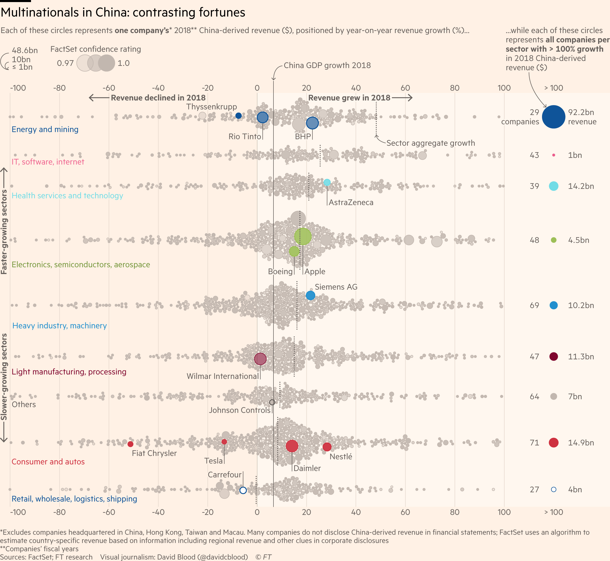

# china-slowing-pains-notebooks

Jupyter notebooks by [David Blood](https://twitter.com/davidcblood) used in the data reporting for [How foreign groups fare in China’s slowing two-track economy](https://www.ft.com/content/c4001b5a-43d8-11e9-b168-96a37d002cd3).

1. [Company revenues data wrangling](https://nbviewer.jupyter.org/github/ft-interactive/china-slowing-pains-notebooks/blob/master/01-wrangle-company-revenues.ipynb)
2. [Beeswarm graphic data formatting](https://nbviewer.jupyter.org/github/ft-interactive/china-slowing-pains-notebooks/blob/master/02-beeswarm.ipynb)

Source: [FactSet](https://www.factset.com)

## Published-then-unpublished beeswarm graphic

